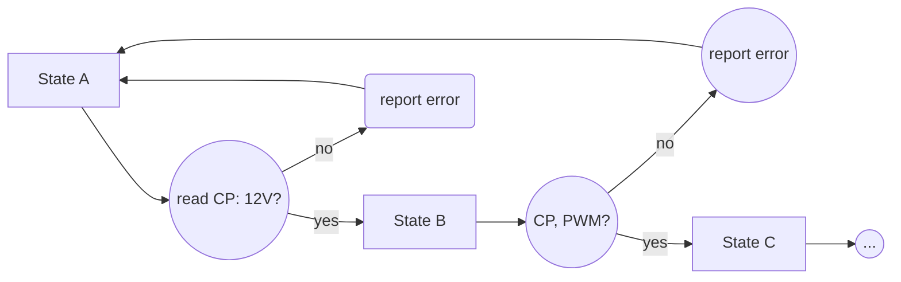

# Welcome to OpenEVSEtester!

Based on EVSim's documentation (available at https://evsim.gonium.net/) this project tries to automate some basic tests required by [SAE J1772](https://de.wikipedia.org/wiki/SAE_J1772).

By now, this project features a PCB. An upcoming BOM, a Firmware (ESP-IDF) and a mobile app will be relased soon.

# Features
- Wallbox connector 7 PIN: L1, L2, L3, N, PE, CP, PP
- Microcontroller ESP32 (ESP32-S2-WROOM), in-circuit programmable by USB (USB-C) connector or serial (you'll need a $1 programmer, i.e. USB/Serial converter)
- both CP and PP protection by fuses and varistors
- battery (LIpO/LiIo) charger with system load: charge while using this device
- buck/boost converter (3V3) to use any available voltage from battery pack (2,4V to 4,2V)
- UI: display (both i2c oled and/or spi tft) tbd: one of this will be removed in further versions
- UI: rotary encoder for modern menu-browsing
- PE breaker: PE can be disconnected by software to simulate a broken PE wire
- PP isolated proximity resistor selection: choose between 100R, 220R, 680R, 1k5 and 4k7 to or any combination (in parallel) to simulate resistors that are outside specification and to test if the wallbox in test handles the voltage drop according to SAE J1772.
- simulate SAE J1772 states A, B, C and E
- simulate diode-fault by shortening diode
- isolated CP measurment by 10-bit 10ksamples/s adc
- isolated mains (L1, L2, L3) measurement by tranformers and internal ADC of ESP32 (voltage, frequency, phasing)
- cr2032 battery-backuped real time clock to timestamp measurements for reports w/o beeing online

# Firmware

A ESP-IDF based firmware for this device can be found here: https://github.com/mistay/openevsetester_firmware/

# mobile app (html/javascript based web if) (TBD!)
## Requirements
- manual mode (handle and read actuators and sensors)
- trigger automatic testinsg
- report downloading

## Credits
Special thanks for ideas, bugfixes and reviews,  [Philipp Aigner](https://aignerelektronik.at)

## License
MIT
